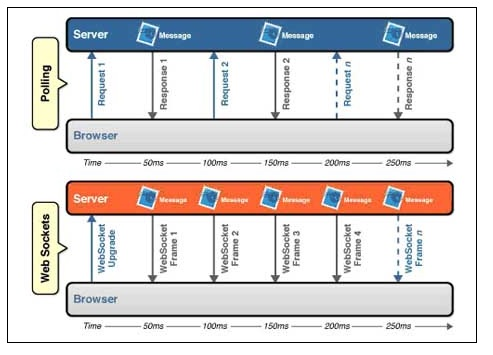

## 웹 소켓(Websocket) 개념
- 사용자와 상호작용하는 웹 서비스를 위해 숨겨진 프레임을(hidden frame) 이용한 방법이나
long polling, stream 등 다양한 방법을 사용했다.
- 그러나, 이러한 방식은 브라우저가 HTTP에 요청을 보내고 웹 서버가 이 요청에 대한 http 응답을 보내는 단방향 메세지 교환 '규칙'을 변경하지 않고 구현한 방식이다.
그렇기 때문에 상호작용하는 웹 페이지를 복잡하고 어려운 코드로 구현해야 했다.

- 보다 쉽게 상호작용하는 웹 페이지를 만들려면 브라우저와 웹 서버 사이에
더 자유로운 양방향 메시지 송수신이 필요하다. 그래서 html5 표준안의 일부로 Websocket API가 등장했다.
- websocket : 소켓을 이용해 자유롭게 데이터를 주고 받을 수 있다. 즉 기존의 요청-응답 관계 방식보다 더 쉽게 데이터를 교환할 수 있다.
- 

## Socket.io란?
- socket.io는 javascript를 이용하여 브라우저 종류에 상관없이 실시간 웹을 구현할 수 있도록 한 기술.
- Socket.io는 WebSocket, FlashSocket, AJAX Long Polling, AJAX Multi part Streaming, IFrame, JSONP Polling을 하나의 API로 추상화한 것.
- 즉, 브라우저와 웹 서버의 종류와 버전을 파악하여 가장 적합한 기술을 선택하여 사용하는 방식이다.
- web socket과 달리 socket.io는 표준 기술이 아니고 node.js 모듈이다.
- Socket.io는 websocket과 마찬가지로 브라우저에서는 javascript를 사용한다.
-  WebSocket을 지원하는 여러 서버 구현체(Jetty, GlassFish, Node.js, Netty, Grizzly 등)가 있지만 Socket.io는 Node.js 하나 밖에 없다.

## 나의 요약
- 웹소켓이란, 웹서버와 브라우저 사이에 실시간 데이터를 자유롭게 받을 수 있는 요청-응답 방식.

#### 출처
- https://d2.naver.com/helloworld/1336
 