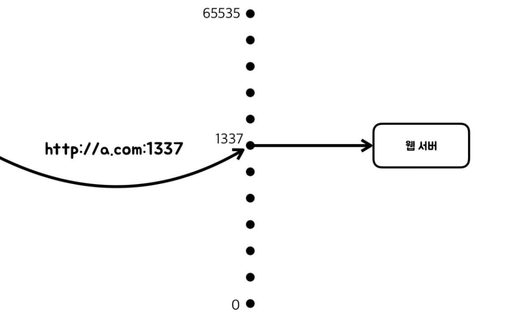

#### 알아야할 4가지 개념 : 서버, 클라이언트, IP, 포트 

### 클라이언트
---
- 요청
- 도메인은 이름. 실제 접속은 도메인과 일치하는 ip주소로 접속한다.

### 서버
---

- 응답
- node는 서버쪽에서 동작하는 __.


### port(포트, 문)
- 0 ~ 65535개
- listening
- [요청 -> 응답 과정] : 
  1. 클라에서 http://a.com:80를 치고 엔터를 친다.
  2. a.com컴퓨터를 찾고, 80번 포트와 연결하고 싶다고 한다.
  3. 80번 포트에서 리스팅하고 있는 웹서버를 요청해서.
  4. 웹서버가 응답할 수 있게 한다. 


- http://opentutorials.org:80/, https://opentutorials.org/ ==> 두개다 접속가능하다. 
- 80번을 생략할 수 있다. (http://a.com:80,  http일 경우 80을 쓰자고 약속해놔서 생략이 가능하다.)
- 1337이라는 포트를 따로 쓸경우는, 1337포트를 웹서버가 리스닝 할 수 있도록 설정한다. 
  1337포트를 쓸경우는 1337로 리스닝하고 있는 곳에서 응답을 받는다.
- 

### ip(internet Protocol address, 인터넷규약주소)
- ip주소 : 인터넷에 접속하기 위한 컴퓨터나 스마트폰등에 부여하는 고유한 주소. 모든 장비에는 ip주소가 부여되야 한다.
- IPv4 주소체계 :	
   1. ip주소를 부여하는 방식으로 현재 쓰이는것이 IPv4 ( IP version 4 ) 규약. 이 주소는 우리도 흔히 알듯이 32비트로 구성된 주소체계로 0~255 사이의 십진수 넷을 구분하여 부여.
   2. 한국은 인터넷 진흥원(KISA)에서 우리나라 내에서 사용할 주소를 관리. 할당받은 주소를 부여해야만 인터넷에 접속할 수 있게 된다.

- 공인 IP :  ?
- 사설 IP : 전체 IP 대역 중에서 특수한 목적으로 사용하기 위해서 몇 개의 대역을 제외하고 공인 IP 대역으로 할당하고 있는데, 제외된 대역 중에서 사설 IP로 사용되는 대역은 사용자가 임의로 부여하고 사용할 수 있지만 서로 연결되지 않도록 되어 있다. 공인 IP주소가 모자랄 경우 사설 IP로 회사나 가정 내의 IP주소를 부여하고 공유기 등에 고정 
- 고정 IP와 유동 IP :


```
### javascript와 HTTP

Web browser ---> (request) ---> web server
            ---< (request) ---<
```

- 이 두개는 http라는 통신방법을 통해 정보를 주고받는다.
request header, response heade 
            
- 크롬 F12 --> 네트워크 : 웹서버와 웹브라우저가 통신하는걸 나타내줌    
- request header : 요청서 
- response header : 응답서 
- content-type : 응답된 타입 text/html, text/css
- user-Agent : 웹브라우저 
- accept-language
- accept-encoding : 압축정보

### cookie
- 쿠키기능을 이용하면 쇼핑카트나 로그인한 기록이 계속 남게된다.
- 쿠키, 세션, 인증(인증이 없으면 사용자 최적화, 보안성 문제가 남게된다.) --> 인증기능을 추가하여 사용자 최적화 보안성 문제를 보안하고자 했습니다.(자소서, 면접 언어)
- set cookie 약속되어 있는 것.

#### cookie & 보안
- 누군가에 의해 cookie값이 읽히면 매우 위험하다.
- 서버에서 브라우저로 쿠키를 구울 때, 암호화된 상태로 굽는다.
서버에 req되었을때, key값을 이용해서 암호화된 정보를 풀어보내준다.
- 쿠키값이 암호화 되서 훨씬 안전하다.
- 아이디, 비밀번호는 절대로 쿠키에 저장하지 않음 위험하다.

### 세션(session)
- 쿠키 : 웹서버가 웹브라우저에 응답하게 되면서 쿠키에 모든 정보를 저장하게 된다(사용자 컴퓨터에).
- session을 만들어서 조합하면 훨씬 더 좋은 접근을 할 수 있다.
- 세션 : 웹서버가 웹브라우저에 응답하게 되면서 식별할 수 있는 id값만 사용자 컴퓨터에 저장하게 되고, 나머지 실제 데이터는 서버에 저장하게 된다.(데이터를 서버에 저장하고 있다.)
- 사용자의 식별자로 구분, 실제 데이터는 서버로 처리
- 'express-session'(node)의  session값은 메모리에서 저장되고 있기때문에 db에 저장해야 한다.
서버를 껏다 키면 데이터가 다 날아가게 되는데, 그렇게 구현하면 안됨
